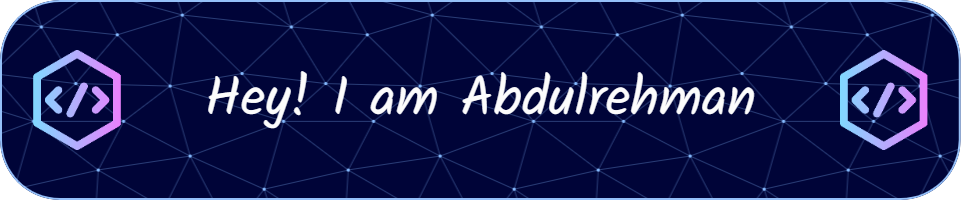

<!-- ====================================================================================================================================================== -->
<!-- ================================================================= HEADER SECTION =================================================================== --> 
<!--  ====================================================================================================================================================== --> 

  
   

   

  
  <b>Lahore, Punjab, Pakistan</b>

  
  

  

---

<!-- ====================================================================================================================================================== -->
<!-- =============================================================== ABOUT ME & MISSION =================================================================== -->
<!-- ====================================================================================================================================================== -->

<h2>🖤 About Me: Code, Chaos & Creatio</h2>

 

  <em><strong>“Code is prose. Projects are poems. And I’m just a storyteller with a keyboard.”</strong></em> ✒️👨🏻‍💻

 

Hello, world — I'm <strong>Abdulrehman</strong>, but those who know me better, simply call me <strong> Gulfaraz </strong>.

Some start with curiosity. I began with stories.

From scribbling verses under the night sky to sketching out ideas in the silence of my code editor — my journey has always balanced between <em>feeling deeply</em> and <em>building purposefully</em>.

These days, my heart beats inside <strong>Manzoom</strong> — an eternal poetic ecosystem, crafted to bring literature, language, and people closer. It's not just a platform — it's a dream I've been carving out line by line, pixel by pixel.

But my craft doesn’t stop there. I’m also diving deep into:
- 🧠 Backend development — where structure meets soul  
- ⚙️ Automation and tooling — building smart VS Code extensions that make life smoother  
- 🤖 AI-driven ideas — integrating intelligence with intention

I’m not just here to code; I’m here to create something that lingers — in the memory, in the mind, in the moment.

If you’ve come this far, welcome to my space. Let’s make something timeless.

 

---

<!-- ====================================================================================================================================================== -->
<!-- ================================================================== TECH ARSENAL ====================================================================== -->
<!-- ====================================================================================================================================================== -->

<h2>🛠️ My Tech Arsenal</h2>

 

## ⚙️ My Favorite Tools & Technologies

> Tools and technologies that I have worked with and love exploring further

<table>
  <tr>
    <td align="center" width="96">
        
       C#
    </td>
    <td align="center" width="96">
        
       Python
    </td>
    <td align="center" width="96">
        
       JavaScript
    </td>
    <td align="center" width="96">
        
       C++
    </td>
    <td align="center" width="96">
        
       Java
    </td>
    <td align="center" width="96">
        
       TypeScript
    </td>
    <td align="center" width="96">
        
       PHP
    </td>
    <td align="center" width="96">
        
       HTML
    </td>
    <td align="center" width="96">
        
       CSS
    </td>
  </tr>
  <tr>
    <td align="center" width="96">
        
       React
    </td>
    <td align="center" width="96">
        
       Tailwind CSS
    </td>
    <td align="center" width="96">
        
       Bootstrap
    </td>
    <td align="center" width="96">
        
       jQuery
    </td>
    <td align="center" width="96">
        
       Node.js
    </td>
    <td align="center" width="96">
        
       Express
    </td>
    <td align="center" width="96">
        
       Flask
    </td>
    <td align="center" width="96">
        
       FastAPI
    </td>
    <td align="center" width="96">
        
       MySQL
    </td>
  </tr>
  <tr>
    <td align="center" width="96">
        
       SQLite
    </td>
        <td align="center" width="96">
        
       PostgreSQL
    </td>
    <td align="center" width="96">
        
       Git
    </td>
    <td align="center" width="96">
        
       GitHub
    </td>
    <td align="center" width="96">
        
       Vercel
    </td>
    <td align="center" width="96">
        
       Azure
    </td>
    <td align="center" width="96">
        
       Linux
    </td>
    <td align="center" width="96">
        
       Kali Linux
    </td>
    <td align="center" width="96">
        
       VS Code
    </td>

  </tr>
  <tr>
      <td align="center" width="96">
        
       Visual Studio
    </td>
    <td align="center" width="96">
        
       Figma
    </td>
    <td align="center" width="96">
        
       Canva
    </td>
    <td align="center" width="96">
        
       Draw.io
    </td>
    <td align="center" width="96">
        
       Git CLI
    </td>
    <td align="center" width="96">
        
       GitHub Actions
    </td>
    <td align="center" width="96">
        
       LaTeX
    </td>
    <td align="center" width="96">
        
       Markdown
    </td>
    <td align="center" width="96">
        
       JSON / YAML
    </td>
  </tr>
</table>

<h3>See more skills</h3>

| Category | Technologies |
|---|---|
| **Languages** |               |
| **Frontend** |      |
| **Backend** |        |
| **Databases** |         |
| **Cybersecurity & Pentesting** |     |
| **AI, Automation & Scraping** |      |
| **Tools & IDEs** |         |
| **Version Control** |     |
| **DevOps & Cloud** |    |
| **Documentation & Markup** |    |
| **Platforms** |    |
| **Design & Visualization** |    |
| **Other Tools** |    |

---
<!-- ====================================================================================================================================================== -->
<!-- ===================================================================== PROJECTS ======================================================================= -->
<!-- ====================================================================================================================================================== -->

<h2>✨ Featured Projects</h2>

 

<!-- 🌟 Top 3 Featured Projects -->

  
  
  

 
 

<b>🔎 Explore More Projects</b>

 

<!-- 📚 Project Grid -->

<table>
  <tr>
    <td align="center">
      <a href="https://github.com/abdulrehmangulfaraz/modular-auth-core">
        
         
      </a>
    </td>
    <td align="center">
      <a href="https://github.com/abdulrehmangulfaraz/online-food-delivery-system">
        
         
      </a>
    </td>
    <td align="center">
      <a href="https://github.com/abdulrehmangulfaraz/web-scraper-project">
        
         
      </a>
    </td>
  </tr>

  <tr>
    <td align="center">
      <a href="https://github.com/abdulrehmangulfaraz/Remote-Desktop">
        
         
      </a>
    </td>
    <td align="center">
      <a href="https://github.com/abdulrehmangulfaraz/SCR-1.0">
        
         
      </a>
    </td>
    <td align="center">
      <a href="https://github.com/abdulrehmangulfaraz/QuickReflex-Reaction-Time-Tracker">
        
         
      </a>
    </td>
  </tr>

  <tr>
    <td align="center">
      <a href="https://github.com/abdulrehmangulfaraz/manzoom">
        
         
      </a>
    </td>
    <td align="center">
      <a href="https://github.com/abdulrehmangulfaraz/Aspirner">
        
         
      </a>
    </td>
    <td align="center">
      <a href="https://github.com/abdulrehmangulfaraz/LehrKI">
        
         
      </a>
    </td>
  </tr>

  <tr>
    <td align="center">
      <a href="https://github.com/abdulrehmangulfaraz/Hobbies-ServiceConnect">
        
         
      </a>
    </td>
    <td align="center">
      <a href="https://github.com/abdulrehmangulfaraz/the-anonymous-stories">
        
         
      </a>
    </td>
    <td align="center">
      <a href="https://github.com/abdulrehmangulfaraz/LehrK-React-Frontend">
        
         
      </a>
    </td>
  </tr>
</table>

---

<!-- ====================================================================================================================================================== -->
<!-- ================================================================= GITHUB ANALYTICS =================================================================== -->
<!-- ====================================================================================================================================================== -->

<h2>📊 My GitHub Analytics & Activity</h2>

 

  

    
    
  

  

    
  

---

<h2>🏆 GitHub Achievements</h2>

  

  
  

---

<h2>🌟 Quote of the Day</h2>

  

  

  

  ---
  

  **"Code is the closest thing to thought, rendered in a form even machines can dream."** — 0x68656865 💻✨
  
  
  
  © 2025 Abdulrehman Gulfaraz - Crafted with ❤️ and lots of ⚡

